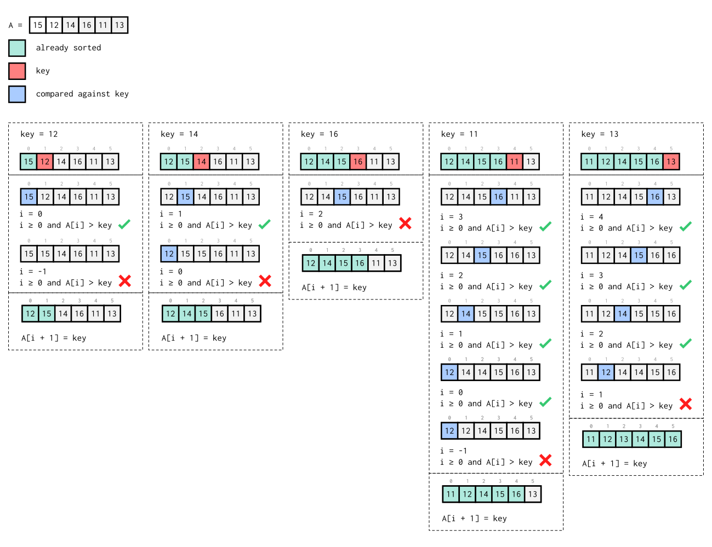

# Insertion Sort

[Insertion sort](https://en.wikipedia.org/wiki/Insertion_Sort) is a sorting
algorithm that sorts an array **in place** by picking the next item from the
right sub-array and placing it into the ordered left sub-array. In order to
place the item in the correct position in the left sub-array, we compare it to
the items in the left until we find an item less than it, at which point we
insert the item in the following slot.

## Pseudocode

```
# A is a 0-indexed array.
insertion-sort(A):
	for j = 1 to length(A)-1:
		key = A[j]
		i = j - 1
		while i >= 0 and A[i] > key:
			A[i+1] = A[i]
			i = i - 1
		A[i+1] = key
```

## Example



## Complexity

|Case|Time Complexity|Reason|
|:-----|:--------|:---------|
|Best case| O(n) | |
|Average case| O(n<sup>2</sup>) | |
|Worst case| O(n<sup>2</sup>) |  |

